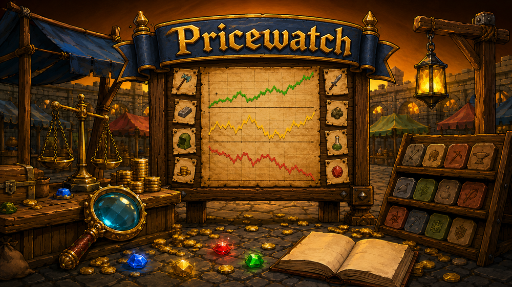

  

Pricewatch is a RuneLite plugin that keeps an eye on the Grand Exchange for you. Pick the items you care about and the plugin shows you what the market is doing to them: live prices straight from the wiki, price and volume charts, how much an item's price jumps around and how quickly it trades, whether buyers or sellers are winning right now, what's left of your buy limit, and what it alchs for. Set an alert and it will tell you when something crosses your number.

Pricewatch only ever reports on the market. It never records how many of an item you own or what you paid for it.

## Features

### Live Grand Exchange prices

- **Prices the moment you look**

  Every watched item shows its current price, refreshed automatically from the wiki's real-time data. The plugin remembers the last prices it saw, so you get real numbers the moment you log in instead of blank dashes.

- **Check any item, no strings attached**

  Search for an item and its full detail view opens straight away. It stays a preview until you actually add it, so a quick price check doesn't clutter your list.

   

- **Show the figure you actually want**

  Choose what the line under each item's name shows — current high, low, average or traded volume, over whichever time window you like — and whether prices are tinted green or red as they move.

  

### Charts

- **Price and volume graphs**

  Every item has graphs of its price and how much of it is being traded, from a day back to a full year. Hover to read exact values, or pop a graph out into its own resizable window for a bigger look.

   

### Detailed market information

- **Know the market before you trade**

  Current high, low and average, how the price has moved today, where it sits in its 30-day range, how much is changing hands, and when the item last actually bought and sold. Prices that have gone stale are dimmed so you don't get fooled by them.

  

- **How easy is it to buy or sell?**

  Simple ratings for how much an item's price jumps around and how quickly it trades, plus a pressure bar showing whether people are mostly buying or mostly selling right now.

  

- **Alchemy values**

  High and Low Alchemy values for every item, including whether alching it would make or lose money once the rune cost is counted.

  

- **The whole picture at once**

  An overview grid puts every price window side by side, for when one figure isn't what you're after.

  

- **Arrange it your way**

  Every section of the detail view can be switched off or moved, so the thing you look at first is the thing at the top.

### Organize your list

- **Make the list your own**

  Star the items you check most, group the rest into your own collapsible categories, or let the plugin sort everything into sensible groups with one click. Sort by name, price or how much the price moved today, or simply drag items into any order you like.

   

- **Handle long lists**

  A compact layout fits more items on screen, and a filter box narrows a long list down to what you're looking for in a couple of keystrokes.

  

- **Share and back up**

  Copy your watchlist and its categories to a short code to share with a friend or keep as a backup, and paste one in to merge it with yours.

  

### Grand Exchange

- **How much of your buy limit is left**

  Pricewatch watches your own Grand Exchange buys and shows how much of an item's 4-hour limit you have used, with a countdown to when it resets.

  

- **Jump in from an offer**

  Opening a Grand Exchange offer opens that item in Pricewatch, and puts a button on the offer screen that does the same on click. Either half can be switched off under *GE Integration*.

  

### Price alerts

- **Get told when it matters**

  Set alerts per item — for example "tell me when the price goes above 1,000" — on the high, low or average price, or on how much it has moved in a day, over whichever timeframe you choose. Alerts arrive through RuneLite's normal notifications, and they can re-arm so you're told again the next time it happens.

   

### On-screen overlay

- **Prices without opening the panel**

  Put your closest-watched items into small draggable boxes right on the game screen, in a standard or compact layout, so you can keep an eye on them while you play.

  

## Pricewatch or Stockpile — not both

Pricewatch started life as the market half of the [Stockpile plugin](https://github.com/Oveduumnakal/Stockpile-Plugin). Stockpile still has all of it — the same watchlist, prices, charts, market information and alerts — and adds tracking on top: how many of an item you own, what you paid for it, and what you have made. Running both would be the same panel twice.

So the two are **mutually exclusive**, and RuneLite enforces it: switching one on switches the other off. Each keeps its own settings and its own list, and neither touches the other's, so going back later picks up where you left off.

**Which one do you want?**

- **Pricewatch** — you want to know what the market is doing, and nothing about your own holdings. The smaller, simpler panel. It will never count what you own or work out your profit.
- **[Stockpile](https://github.com/Oveduumnakal/Stockpile-Plugin)** — you want all of that *and* quantities, cost basis and profit.

If you are not sure, start here. Switching costs nothing.

## Links

- [Report a bug](https://github.com/Oveduumnakal/Pricewatch-Plugin/issues/new?template=bug_report.yml)
- [Request a feature](https://github.com/Oveduumnakal/Pricewatch-Plugin/issues/new?template=feature_request.yml)
- [Buy me a coffee](https://buymeacoffee.com/oveduumnakal)
